<h4>

The SYSTEM Menu Consists of 4 sub-menus :: Day Begin | Fiscal Change | LogIn | SignOut| Exit

</h4>

## Accounts

<ul>
<li>Fee Management</li>
<li>Scholarship Management</li>
<li>Billing Management</li>
<li>Inventory Management</li>
</ul>

## Academics

<ul>
<li>Attendance Management</li>
<li>Exam Management</li>
<li>Leave Management</li>
<li>Notice Management</li>
</ul>

## Others

<ul>
<li>Grade Management</li>
<li>Subject Management</li>
<li>Hostel Management (optional)</li>
<li>Employee Management</li>
<li>Transportation Management</li>
<li>Bank Credential Management</li>
<li>Case/Complain Management</li>
<li>Library Management</li>
</ul>

## Founder Feature

<ul>
<li>Overall Report Analizer Chart</li>
<li>School Routine Maker</li>
<li>Exam Report Generator</li>
<li>Attendance Report Generator</li>
</ul>

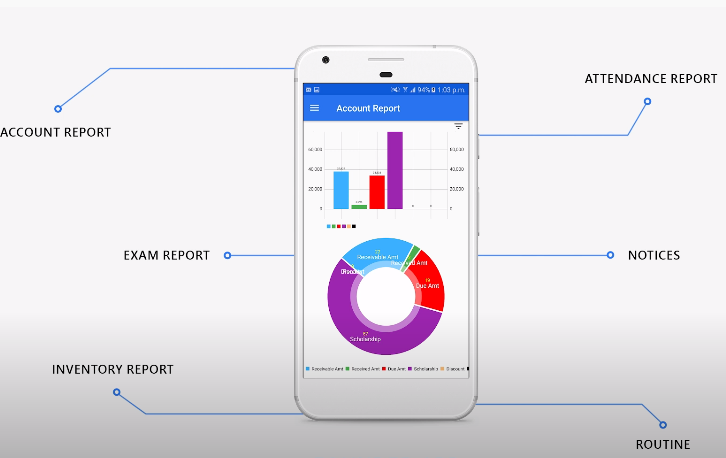

## Student Portal

Student Portal Features

<ul>
<li>Fee Status & Notification</li>
<li>leave Application</li>
<li>Online Exam Result </li>
<li>Notice & Daily Routine</li>
<li>Homework Notification</li>
<li>Manage Complain</li>
</ul>

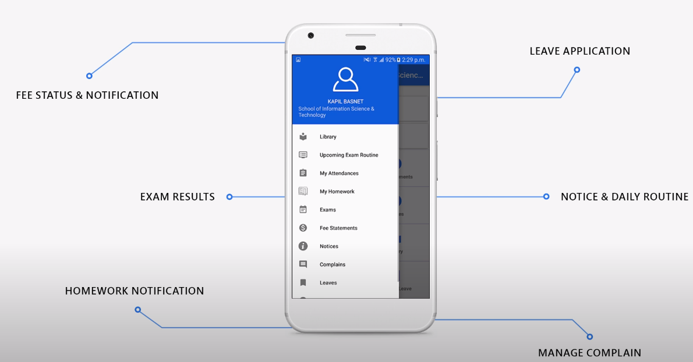

## Credit Bill Generation

<ul>
<li>Fee Status & Notification</li>
<li>leave Application</li>
<li>Online Exam Result </li>
<li>Notice & Daily Routine</li>
<li>Homework Notification</li>
<li>Manage Complain</li>
</ul>

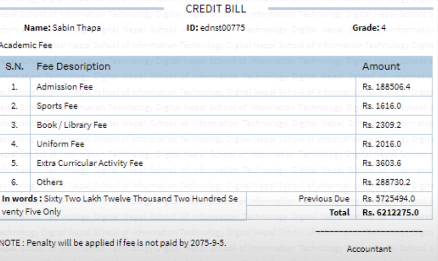

## Marksheet Generator

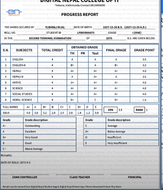

## Character Certificate Generator from report of students collected.

## Smart ID Card Generator / Traditational Id card Generator

## Eg;- (Student Management Adding Student)

How we take Input

## Eg;-Watch employee data(example)

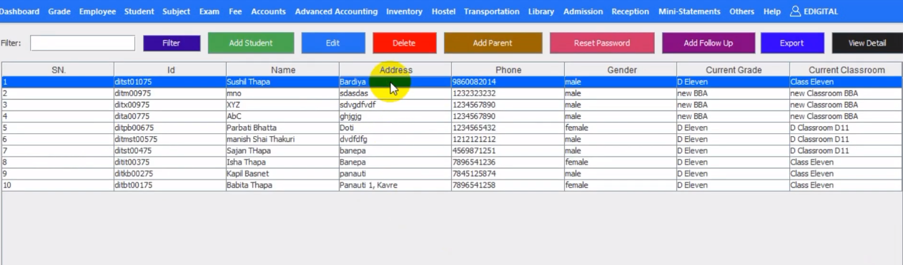

## Eg;- (Employee Management Adding Employee)

How we take Input
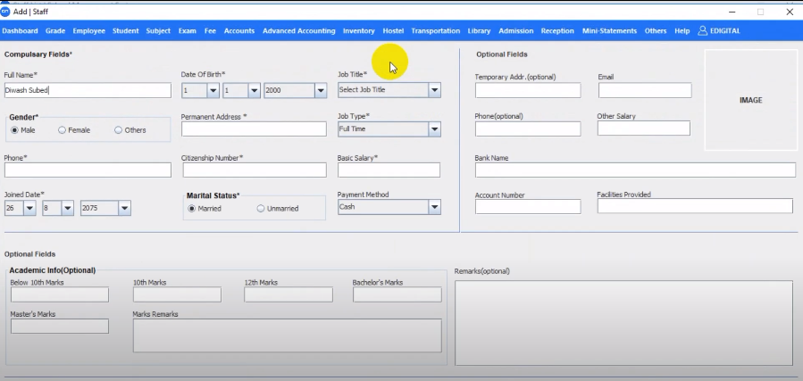

## Eg;- watching All Employee Data Collected

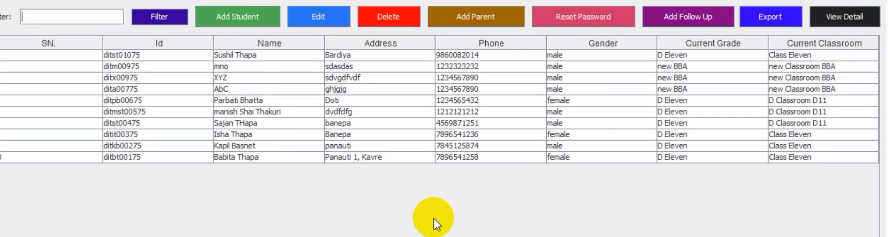

## Eg;-Fee Data Registration

How we take Input
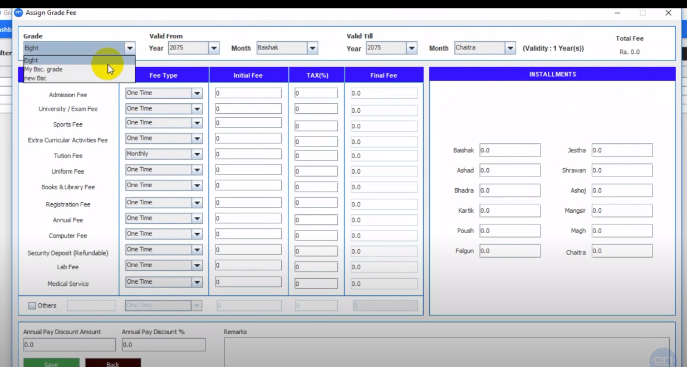

## Eg;- watch Stored Fee Data Collection

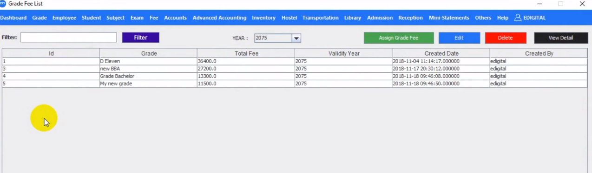

## Eg;-Exam Management

How we take Input

## Eg;-Stored Registered Exams

## Eg;- Registered Exams Overview

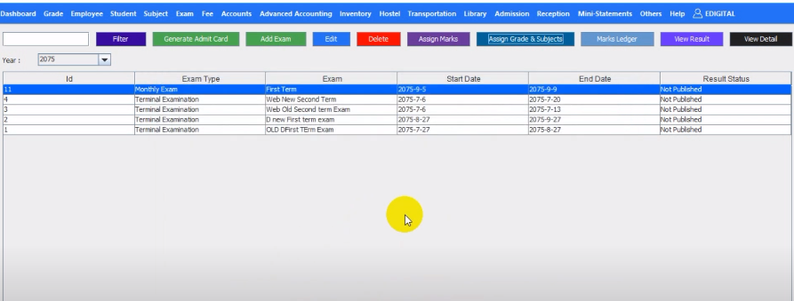
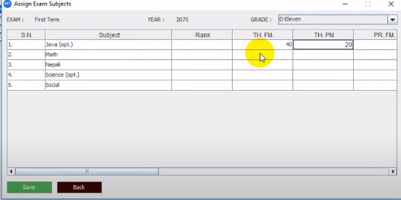

## Eg;- Registered Exams (some features)

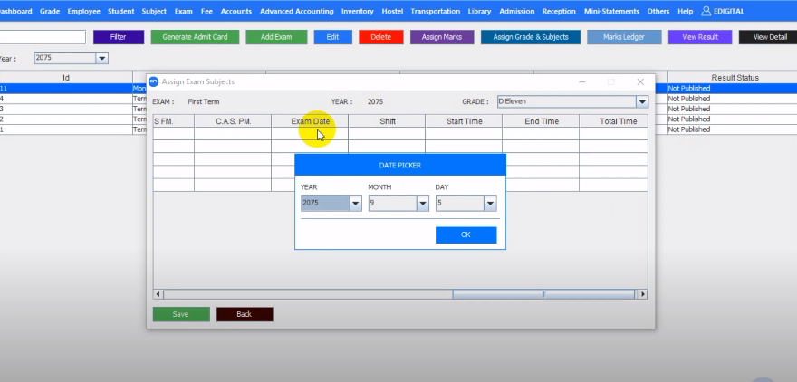

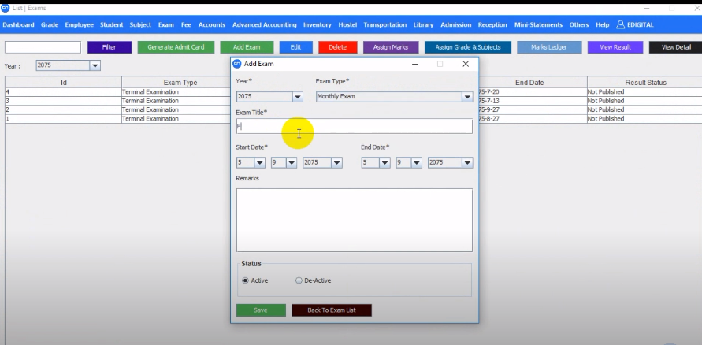

## Eg;- Library Management(some features)

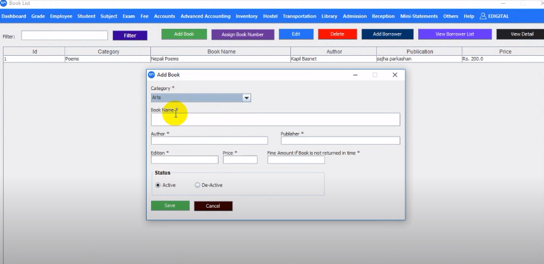
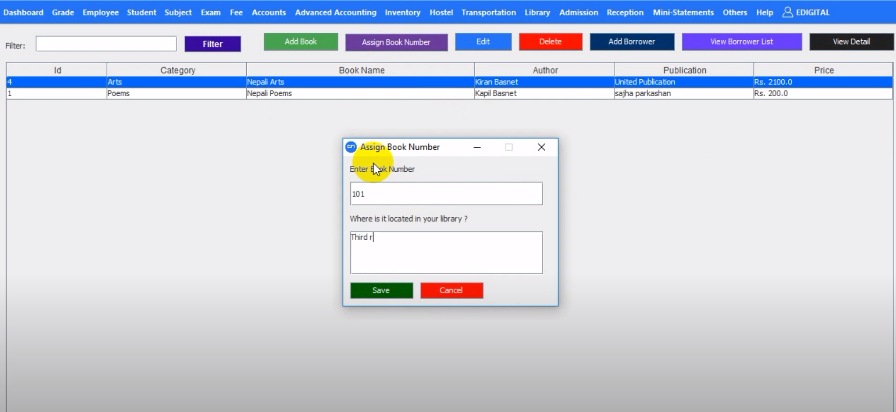
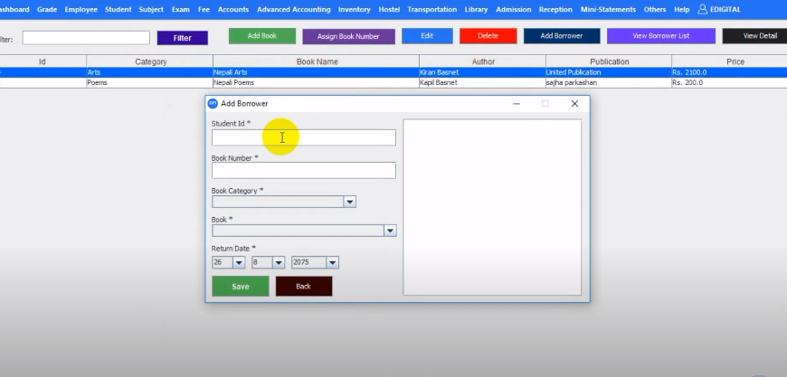
